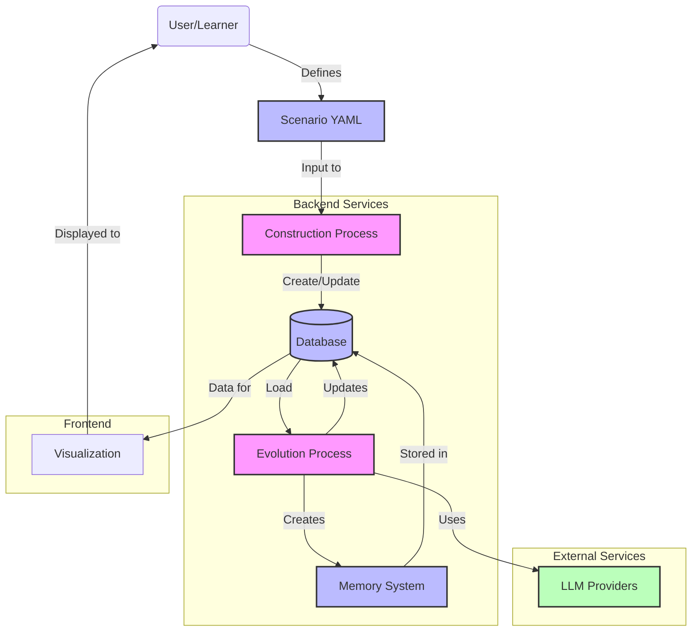
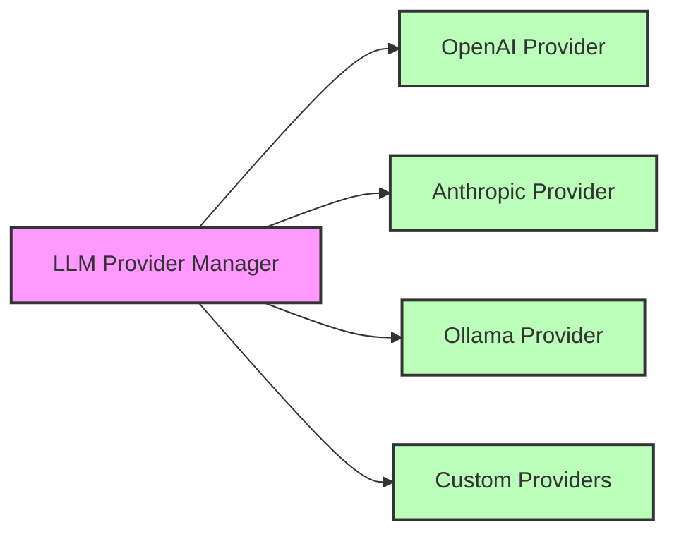
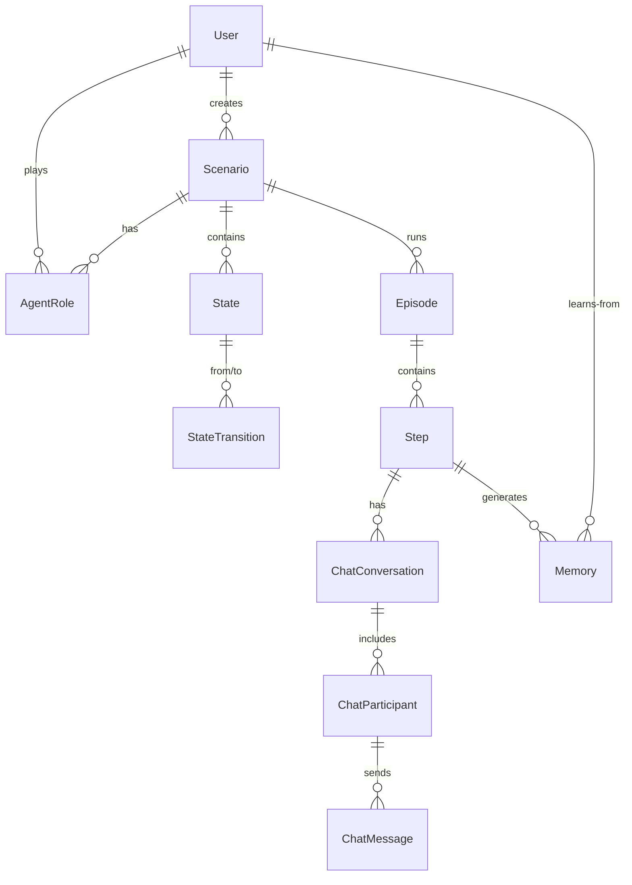
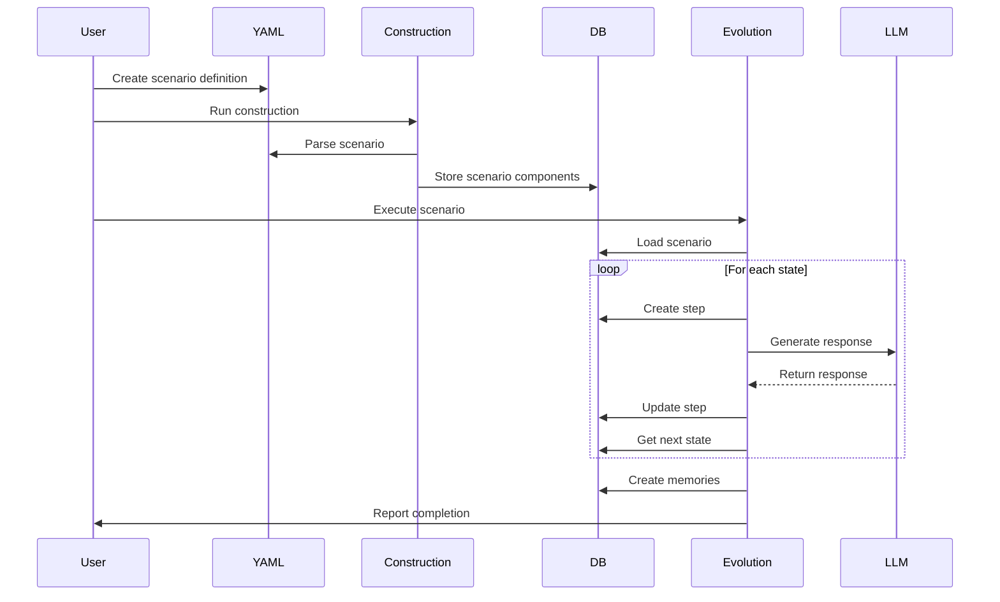

# Architecture Overview

This document provides an in-depth explanation of the AGIR Learning system architecture.

## Architecture Diagram



## System Components

### 1. Core Components

#### Scenario Construction Process

The construction process transforms YAML scenario definitions into database records:

- **YAML Parser**: Loads and validates scenario definitions
- **Database Mapper**: Maps scenario elements to database records
- **Entity Manager**: Creates or updates necessary database entities

See [Construction Process](construction.md) for detailed information.

#### Evolution Process

The evolution process executes scenarios and facilitates learning:

- **Episode Manager**: Manages the execution of scenario episodes
- **State Processor**: Processes individual states and transitions
- **Conversation Engine**: Facilitates multi-agent conversations
- **Memory Generator**: Creates memories from episode experiences

See [Evolution Process](evolution.md) for detailed information.

### 2. Data Models

The system uses the following key data models:

- **Users**: Represents both human learners and AI agents
- **Scenarios**: Defines the learning experience structure
- **States**: Individual steps within a scenario
- **Transitions**: Connections between states
- **Episodes**: Individual runs of a scenario
- **Steps**: Execution of individual states within an episode
- **Memories**: Learning insights derived from episodes

### 3. Multi-Provider LLM Architecture

A key architectural feature is the multi-provider LLM system:



Benefits of this architecture:

- **Model Flexibility**: Different roles can use different LLM models
- **Cost Optimization**: Use powerful models only where needed
- **Provider Redundancy**: Switch between providers if one is unavailable
- **Local Deployment**: Support for local models through Ollama

### 4. Database Schema

The database schema implements the following key relationships:



### 5. Memory System

The memory system captures learning insights from episodes:

- **Vector Storage**: Stores memories in embeddings for semantic retrieval
- **Memory Generators**: Creates memories from episode content
- **Retrieval Systems**: Fetches relevant memories for new scenarios

## Technical Implementation

### 1. Package Structure

```
src/
├── common/         # Common utilities and shared components
├── construction/   # Scenario construction component
├── evolution/      # Scenario evolution component
├── llm/            # LLM provider integrations
└── visualization/  # Results visualization component
```

### 2. Request Processing Flow



### 3. LLM Provider Integration

To integrate a new LLM provider:

1. Create a new provider class in `src/llm/`
2. Implement the required interface methods
3. Add the provider to the provider registry
4. Enable the provider in the CLI

## System Requirements and Performance

### Hardware Requirements

- **Minimal**: 4GB RAM, 2 CPU cores, 10GB disk space
- **Recommended**: 8GB+ RAM, 4+ CPU cores, 20GB+ disk space
- **Database**: PostgreSQL server with 5GB+ storage

### Performance Considerations

- **LLM Latency**: Response times vary by provider and model
- **Database Scaling**: Consider connection pooling for high concurrency
- **Vector Storage**: FAISS optimizations for large memory collections

## Security Model

- **API Keys**: Stored in `.env` file, never committed to version control
- **Database Access**: Controlled via connection string credentials
- **User Data**: Stored in database with proper access controls
- **LLM Prompt Safety**: Sanitization of inputs to prevent prompt injection

## Future Architecture Extensions

- **Web Interface**: A more sophisticated UI for scenario management
- **API Service**: RESTful API for integration with other systems
- **Distributed Execution**: Support for running scenarios across multiple nodes
- **Real-time Collaboration**: Support for multiple learners in a single scenario
- **Federated Learning**: Sharing insights across learner populations 