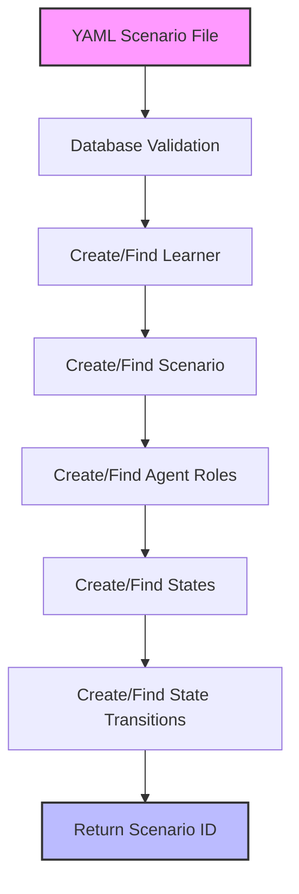
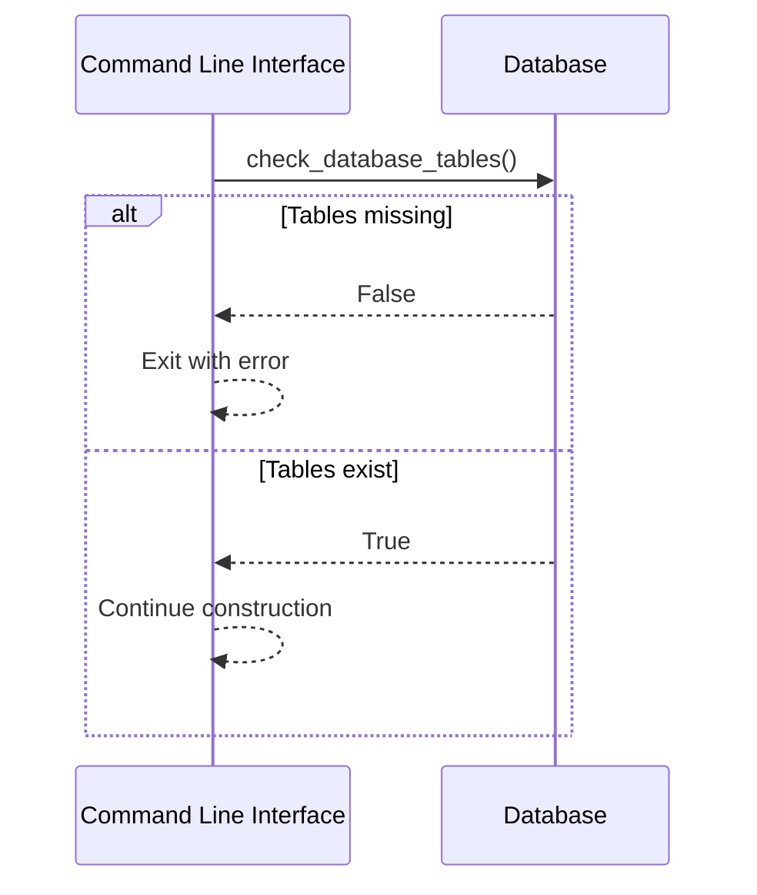

# Scenario Construction in AGIR Learning

This document explains the construction phase in AGIR Learning, where a scenario is created from a YAML configuration file and set up in the database.

## Overview

Scenario construction is the foundation of the AGIR Learning system. It transforms a YAML definition into a fully structured learning environment with agents, states, and transitions.



## Construction Process

The construction process follows a sequential, modular approach with the following steps:

### 1. Database Validation

Before proceeding with scenario construction, the system verifies that all required database tables exist to ensure data integrity.



### 2. Learner Creation

The learner is the central user whose skills are being developed through the scenario.

- System extracts learner information from the YAML configuration
- Checks if the learner exists in the user table based on username
- Creates a new user record if not found

### 3. Scenario Creation

The scenario represents the overall learning experience:

- System checks if a scenario with the given name already exists
- Creates a new scenario record linked to the learner if not found
- Stores metadata like description and evolution objectives

### 4. Agent Roles Creation

Roles represent different AI-driven participants in the scenario:

- For each role defined in the YAML, the system creates an agent role record
- Each role gets assigned its own LLM model as specified in the configuration
- Special handling exists for the "learner" role, which references the main user

### 5. States Creation

States define the different steps or stages in the learning scenario:

- Each state has a name, description, and associated role
- States with role="learner" represent actions by the human learner
- States determine what responses or behaviors are expected at each point

### 6. State Transitions Creation

Transitions define the flow between states:

- Each transition has a "from" state and a "to" state
- Transitions control the logical progression of the learning experience
- Together with states, they form a directed graph of possible paths

## Code Structure

The construction process is implemented through a set of modular files:

- `run_construction.py` - Main entry point for construction
- `a_create_or_find_learner.py` - Handles learner creation
- `b_create_or_find_scenario.py` - Handles scenario creation
- `c_create_or_find_agent_roles.py` - Handles agent role creation
- `d_create_or_find_states.py` - Handles state creation
- `e_create_or_find_state_transitions.py` - Handles transition creation

## YAML Configuration Example

```yaml
scenario:
  name: "Medical Diagnosis Training"
  description: "Training for medical students in patient diagnosis"

  # The learner is the central user whose skills are being developed
  learner:
    username: "medical_student"
    first_name: "Jane"
    last_name: "Doe"
    model: "gpt-4"
    evolution_objective: "Improve diagnostic skills and patient communication"

  # Roles represent different agents in the scenario
  roles:
    - name: "patient"
      model: "gpt-4"
      description: "Patient with various symptoms seeking diagnosis"
    - name: "nurse"
      model: "gpt-3.5-turbo"
      description: "Assists with patient information and preliminary assessment"

  # States define the stages of the scenario
  states:
    - name: "patient_intake"
      role: "nurse"
      description: "Initial patient information gathering"
    - name: "patient_interview"
      role: "learner"
      description: "Medical student interviews the patient"
    - name: "diagnosis_formulation"
      role: "learner"
      description: "Medical student formulates a diagnosis"

  # Transitions define the flow between states
  transitions:
    - from: "patient_intake"
      to: "patient_interview"
    - from: "patient_interview"
      to: "diagnosis_formulation"
```

## Extending the Construction Process

The modular nature of the construction process makes it easy to extend:

1. Add new components to the YAML schema
2. Create corresponding database models
3. Add a new module to handle the creation/finding of those components
4. Update `run_construction.py` to incorporate the new module

This design ensures that the system can evolve to accommodate new learning paradigms and scenario types while maintaining a consistent construction process.
