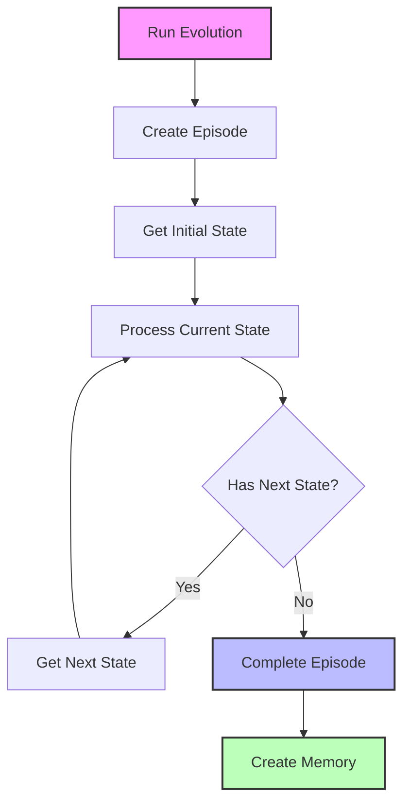
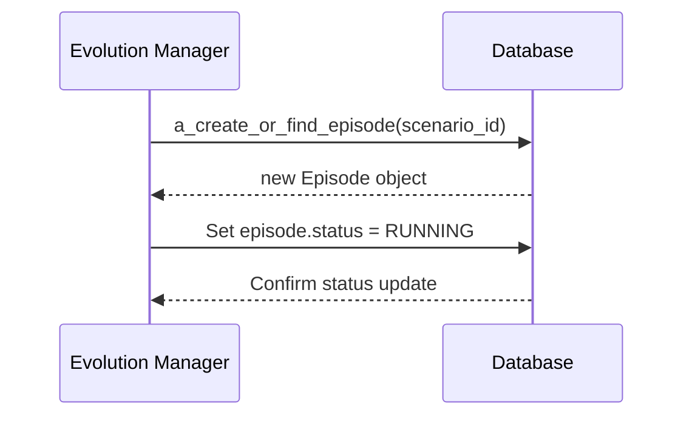
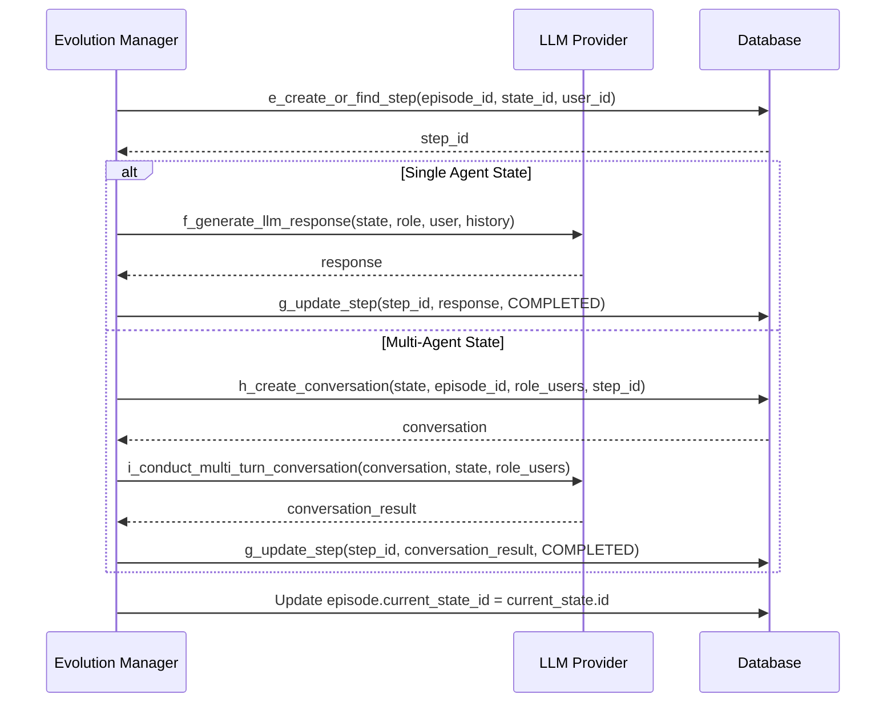
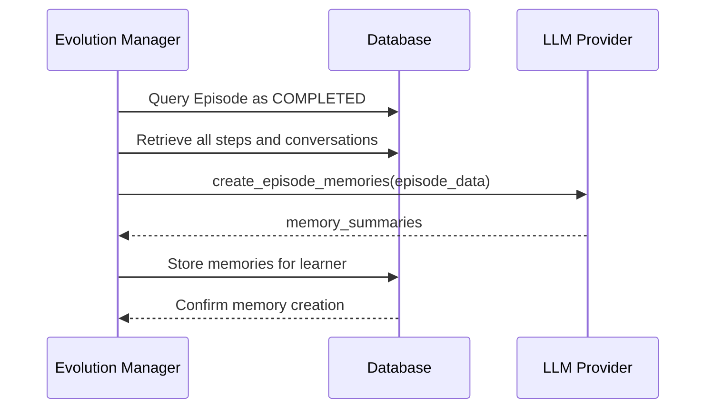
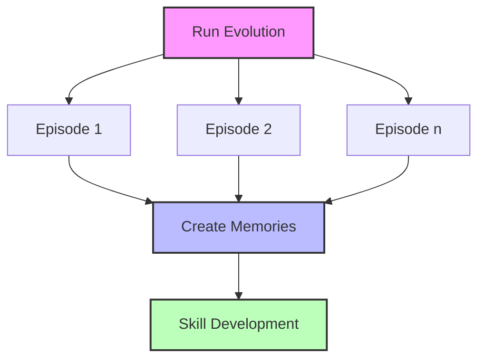

# Scenario Evolution in AGIR Learning

This document explains the evolution phase in AGIR Learning, where scenarios are executed to create interactive learning experiences that help learners develop skills through simulated practice and guided reflection.

## Overview

Evolution is the core learning process in AGIR Learning. It brings constructed scenarios to life by executing the defined states and transitions through AI agents that interact with the learner. This creates a dynamic, responsive learning environment that adapts to the learner's responses.

## Evolution Process

The evolution process follows a dynamic execution model with the following steps:

### 1. Episode Creation

An episode represents a single run-through of a scenario:

- System creates a new episode record linked to the scenario and learner
- Sets the initial status to RUNNING
- Prepares the context for agent interactions

### 2. State Processing

For each state in the scenario, the system:

- Identifies the roles involved in the current state
- Creates or retrieves users for each role
- Processes the state according to its type:
  - For single-agent states: Generates a response from the agent
  - For multi-agent states: Conducts a multi-turn conversation

### 3. Step Creation and Execution

Each state execution is tracked as a step:

- System creates a step record with RUNNING status
- For single-agent responses:
  - Generates the LLM response based on the state, role, and context
  - Updates the step with the generated content
  - Marks the step as COMPLETED
- For multi-agent conversations:
  - Creates a conversation record linked to the step
  - Facilitates a multi-turn interaction between agents
  - Stores messages from all participants
  - Updates the step with conversation results

### 4. State Transition

After completing a state, the system determines the next state:

- Queries the database for valid transitions from the current state
- If multiple transitions exist, uses context and agent input to select the appropriate one
- If no transitions exist, the episode is complete

### 5. Episode Completion

When all states have been processed:

- System marks the episode as COMPLETED
- Creates memories based on the episode experience
- These memories can be used for future scenarios or episodes

### 6. Memory Creation

A critical component of the evolution process is memory creation:

- System summarizes the episode experience
- Extracts key insights and learning points
- Creates a permanent memory record for the learner
- These memories form the foundation for skill development and progression

## Code Structure

The evolution process is implemented through a set of modular files:

- `run_evolution.py` - Main entry point for evolution
- `a_create_or_find_episode.py` - Handles episode creation
- `b_get_initial_state.py` - Identifies the starting state
- `c_get_state_roles.py` - Retrieves roles for a state
- `d_get_or_create_user_for_state.py` - Handles user creation for roles
- `e_create_or_find_step.py` - Creates step records
- `f_generate_llm_response.py` - Generates LLM responses
- `g_update_step.py` - Updates step records
- `h_create_conversation.py` - Creates conversation records
- `i_conduct_multi_turn_conversation.py` - Handles multi-agent conversations
- `j_get_next_state.py` - Determines the next state
- `k_create_memory.py` - Creates memory records

## Running Multiple Episodes

The evolution system supports running multiple episodes for a scenario:

This multi-episode approach allows for:
- Iterative skill development
- Practice with variations in the scenario
- Progressive difficulty increases
- Comparative analysis of learner improvement

## Error Handling

The evolution process includes robust error handling:

- If a step fails, it's marked with FAILED status and includes error details
- If an episode encounters critical errors, it's marked as FAILED
- All errors are logged for analysis and debugging
- The system can recover from certain errors and continue execution

## Extending the Evolution Process

The modular nature of the evolution process makes it easy to extend:

1. Add new step types by extending the step processing logic
2. Implement new conversation patterns in the multi-turn conversation handler
3. Create specialized memory creation methods for different learning domains
4. Add analytics and visualization components to track learner progress

These extension points allow AGIR Learning to adapt to diverse learning domains while maintaining a consistent evolution process.
